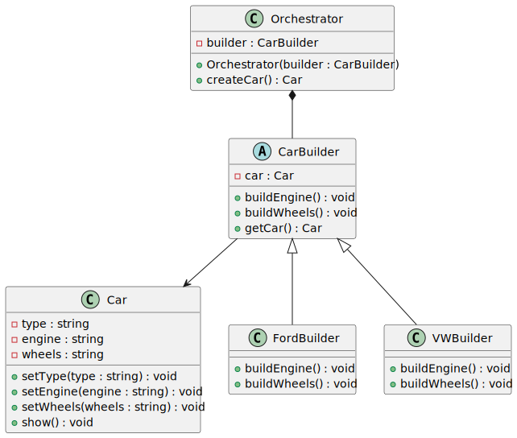

# Builder Design Pattern (C++)

This project demonstrates the **Builder Design Pattern** using a `Car` example.  
It shows how an `Orchestrator` (traditionally called *Director*) constructs a `Car` step by step  
using different `CarBuilder` implementations.

---

## 📦 Project Structure
```
builder/
├── builder_pattern.hpp   # Class declarations
├── builder_pattern.cpp   # Class definitions
├── main.cpp              # Demo program
├── builder_pattern.puml  # PlantUML source
├── builder_pattern.png   # UML diagram (embedded below)
├── builder_pattern.svg   # High-resolution UML
└── README.md
```

---

## 📊 UML Diagram



> UML generated with PlantUML.  
> 📄 [View UML Source (builder_pattern.puml)](builder_pattern.puml)

---

## 🛠 Classes Overview

- **Car** → the product being built.  
- **CarBuilder (abstract)** → defines the steps to build a car.  
- **FordBuilder** → builds a Ford-specific car.  
- **VWBuilder** → builds a Volkswagen-specific car.  
- **Orchestrator** → orchestrates the build process using a given builder.  

Key design points:
- `std::unique_ptr` used to enforce **exclusive ownership**.
- Public inheritance (`FordBuilder : public CarBuilder`) allows polymorphism.

---

## 🚗 Example Output

```
Built Ford:
Car Type: Ford
Engine: Ford EcoBoost Engine
Wheels: Ford Alloy Wheels
------------------
Built Volkswagen:
Car Type: VW
Engine: VW TSI Engine
Wheels: VW Sport Wheels
```

---

## 🔧 Build Instructions

### Compile with g++
```bash
g++ main.cpp builder_pattern.cpp -o builder_demo -std=c++17
./builder_demo
```

---

## 📘 About the Pattern

The **Builder Pattern** separates the construction of a complex object from its representation,  
allowing the same construction process to create different representations.

- **Why `std::unique_ptr`?**
  - Ensures clear ownership of builders and cars.
  - Matches the UML **composition relationship** (black diamond).
- **Why Orchestrator?**
  - Centralizes the construction steps.
  - Prevents clients from needing to know build details.

---

## 📌 Credits

- Written in **C++17**  
- UML generated with **PlantUML**  
